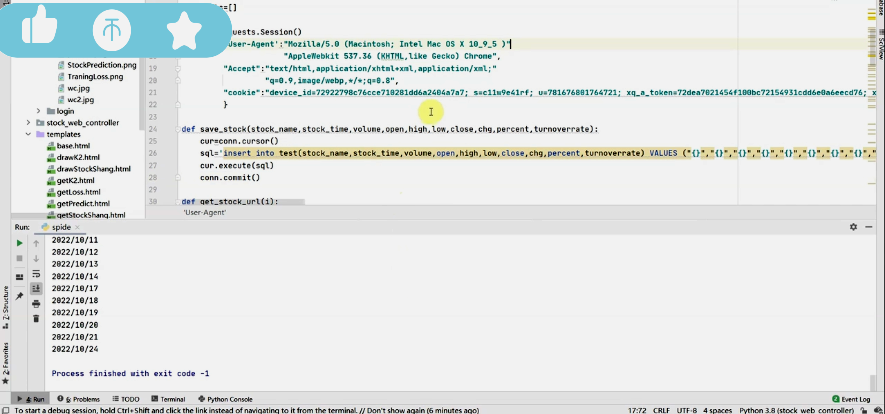
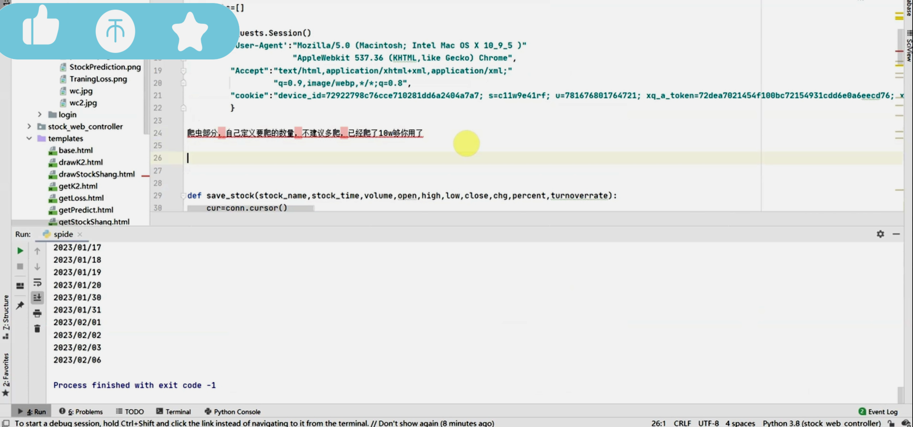
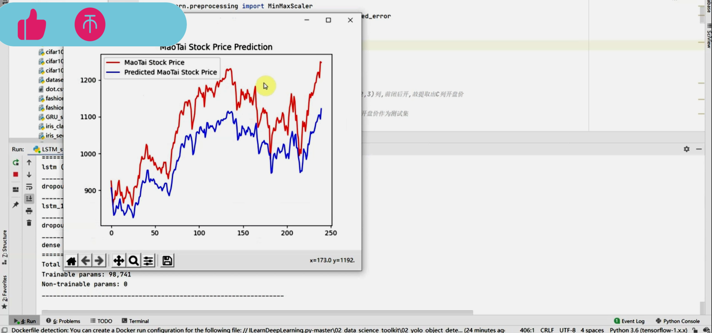
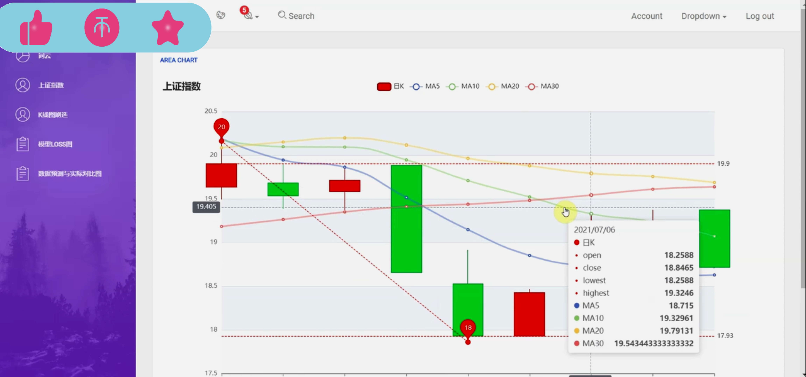
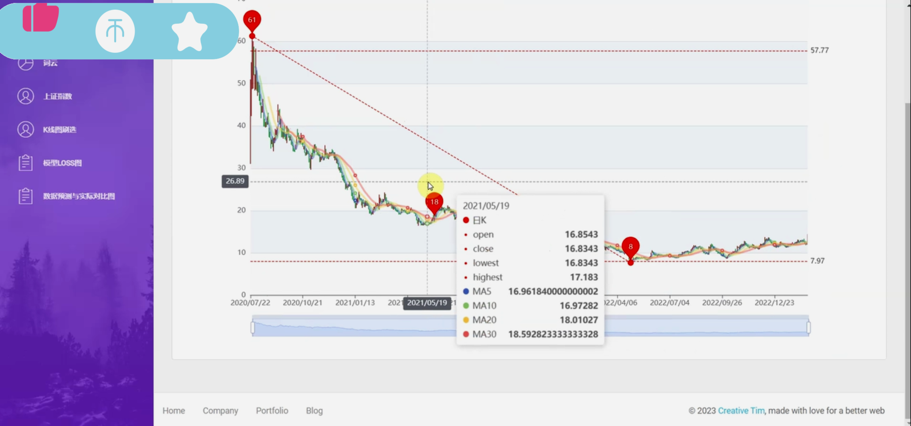
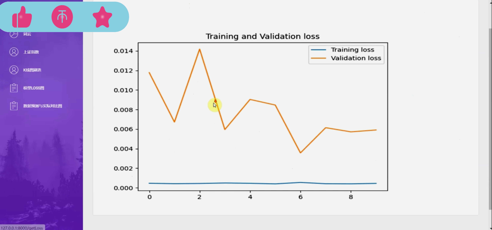
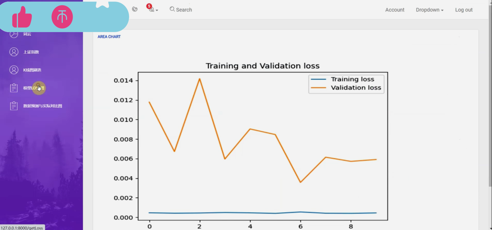

## 计算机毕业设计LSTM+Tensorflow股票分析预测 基金分析预测 股票爬虫 大数据毕业设计 深度学习 机器学习 数据可视化 人工智能 Hadoop PySpark 机器学习 深度学习 Python Scrapy分布式爬虫 机器学习 大数据毕业设计 数据仓库 大数据毕业设计 文本分类 LSTM情感分析 大数据毕业设计 知识图谱 大数据毕业设计 预测系统 实时计算 离线计算 数据仓库 人工智能 神经网络

## 要求
### 源码有偿！一套(论文 PPT 源码+sql脚本+教程)

### 
### 加好友前帮忙start一下，并备注github有偿纯python股票
### 我的QQ号是2827724252或者798059319或者 1679232425或者微信:bysj2023nb 或bysj1688

# 

### 加qq好友说明（被部分 网友整得心力交瘁）：
    1.加好友务必按照格式备注
    2.避免浪费各自的时间！
    3.当“客服”不容易，repo 主是体面人，不爆粗，性格好，文明人。

演示视频

https://www.bilibili.com/video/BV1xS411N7oU/?spm_id_from=333.999.0.0

## 开发技术：
基于TensorFlow-LSTM的股票预测系统开题报告

一、研究背景与意义

随着信息技术的飞速发展，股票市场作为现代经济活动的重要组成部分，其价格波动受到广泛关注。投资者们迫切希望通过科学的方法预测股票价格，以优化投资决策，实现利润最大化。然而，传统的股票预测方法如技术分析和基本面分析，存在主观性强、数据处理能力有限等不足，难以满足现代投资者的需求。因此，利用机器学习技术，特别是深度学习技术，对股票价格进行预测成为当前研究的热点。

TensorFlow作为一种开源的机器学习框架，以其强大的计算能力和灵活的编程接口，被广泛应用于各种深度学习模型中。其中，长短期记忆网络（LSTM）作为一种特殊的循环神经网络（RNN），能够有效地处理时间序列数据中的长期依赖问题，对于股票价格预测等时序任务具有良好的适应性。因此，本研究旨在基于TensorFlow框架，构建LSTM股票预测系统，以提高股票预测的准确性和效率。

二、研究目的

本研究的主要目的包括：

探究LSTM模型在股票预测中的应用，分析其优势和局限性，为后续的模型优化提供理论基础。
构建基于TensorFlow的LSTM股票预测系统，实现对股票价格的自动化预测。
评估该预测系统的性能，并通过对比实验验证其优于传统的股票预测方法。
根据实验结果，提出改进策略，进一步优化预测系统的性能。
三、研究内容与方法

数据收集与预处理
本研究将收集历史股票数据，包括开盘价、收盘价、最高价、最低价、交易量等指标，并进行数据清洗、归一化等预处理操作，以便于后续模型的训练和测试。

LSTM模型构建
基于TensorFlow框架，构建LSTM模型。该模型将采用多层LSTM网络结构，以捕捉股票价格数据中的长期依赖关系。同时，结合Dropout等正则化技术，防止模型过拟合。

模型训练与测试
将预处理后的数据划分为训练集和测试集，利用训练集对LSTM模型进行训练，并通过测试集评估模型的性能。在训练过程中，采用交叉验证等策略，确保模型的泛化能力。

结果分析与模型优化
根据实验结果，分析LSTM模型在股票预测中的表现，找出其优势和不足。针对模型存在的问题，提出改进策略，如调整网络结构、优化超参数等，以进一步提高预测系统的性能。

四、预期成果与贡献

本研究预期将实现以下成果和贡献：

构建基于TensorFlow的LSTM股票预测系统，为投资者提供一种科学、高效的股票预测工具。
验证LSTM模型在股票预测中的有效性，为深度学习在金融领域的应用提供实证支持。
通过对预测系统性能的评估和优化，为后续的模型改进提供理论基础和实践经验。
五、研究计划与时间安排

本研究将分为以下几个阶段进行：

第一阶段（X个月）：进行数据收集、预处理和模型构建。
第二阶段（X个月）：进行模型训练和测试，分析实验结果。
第三阶段（X个月）：根据实验结果提出改进策略，对预测系统进行优化。
第四阶段（X个月）：撰写论文并准备答辩。
六、参考文献

（此处列出与本研究相关的参考文献）

以上为本研究的开题报告，希望得到各位专家、学者的指导和支持。

在TensorFlow（现在通常使用TensorFlow 2.x或更高版本）中，构建一个简单的LSTM模型来预测股票价格是一个涉及多个步骤的过程。以下是一个简化的代码示例，用于说明如何使用Keras（TensorFlow的高级API）来构建和训练一个LSTM模型进行股票预测。

请注意，这只是一个起点，并且为了简化，许多重要的步骤（如数据预处理、特征工程、模型调优、验证集和测试集的使用等）都被省略了。

python
import numpy as np  
import tensorflow as tf  
from tensorflow.keras.models import Sequential  
from tensorflow.keras.layers import LSTM, Dense  
from sklearn.model_selection import train_test_split  
from sklearn.preprocessing import MinMaxScaler  
  
# 假设我们已经有了一个名为'stock_data'的NumPy数组，其中包含了股票价格数据  
# stock_data 应该是一个二维数组，其中每一行是一个时间步，包含开盘价、收盘价等特征  
# 这里只是一个示例，你需要用自己的数据替换它  
# stock_data = np.load('path_to_your_stock_data.npy')  
  
# 为了简单起见，我们假设stock_data只包含收盘价，并且已经按时间顺序排列  
# 假设 stock_data.shape 是 (samples, 1)，其中samples是数据点的数量  
  
# 数据预处理（这里只展示了部分步骤）  
# ... (例如：标准化、创建序列、创建目标变量等)  
  
# 示例：将数据集划分为训练集和测试集  
# 这里我们使用随机划分，但在实际中应该使用时间序列的连续切片  
X_train, X_test, y_train, y_test = train_test_split(X_processed, y_processed, test_size=0.2, random_state=42)  
  
# 重塑输入数据以匹配LSTM的输入要求  
# [samples, time_steps, features]  
X_train = np.reshape(X_train, (X_train.shape[0], X_train.shape[1], 1))  
X_test = np.reshape(X_test, (X_test.shape[0], X_test.shape[1], 1))  
  
# 构建LSTM模型  
model = Sequential()  
model.add(LSTM(50, activation='relu', input_shape=(X_train.shape[1], 1)))  
model.add(Dense(1))  
  
# 编译模型  
model.compile(optimizer='adam', loss='mean_squared_error')  
  
# 训练模型  
model.fit(X_train, y_train, epochs=100, batch_size=32, verbose=1)  
  
# 评估模型  
loss = model.evaluate(X_test, y_test)  
print(f'Test Loss: {loss}')  
  
# 预测  
# 假设我们有一个新的股票价格序列 new_stock_data  
# new_stock_data = ...  
# new_stock_data = np.reshape(new_stock_data, (1, new_stock_data.shape[0], 1))  
# predictions = model.predict(new_stock_data)  
  
# 输出预测结果  
# print(predictions)
请注意，上述代码中的X_processed和y_processed代表预处理后的特征和目标变量。在实际应用中，你需要执行适当的预处理步骤，如标准化、归一化、创建滑动窗口（以形成LSTM所需的序列）等。此外，你还需要确保你的数据具有正确的形状，以便能够输入到LSTM模型中。

此外，模型的架构（如LSTM层的数量、单元数、激活函数等）和超参数（如优化器、损失函数、批次大小、训练轮数等）都需要根据你的具体任务和数据进行调整和优化。

